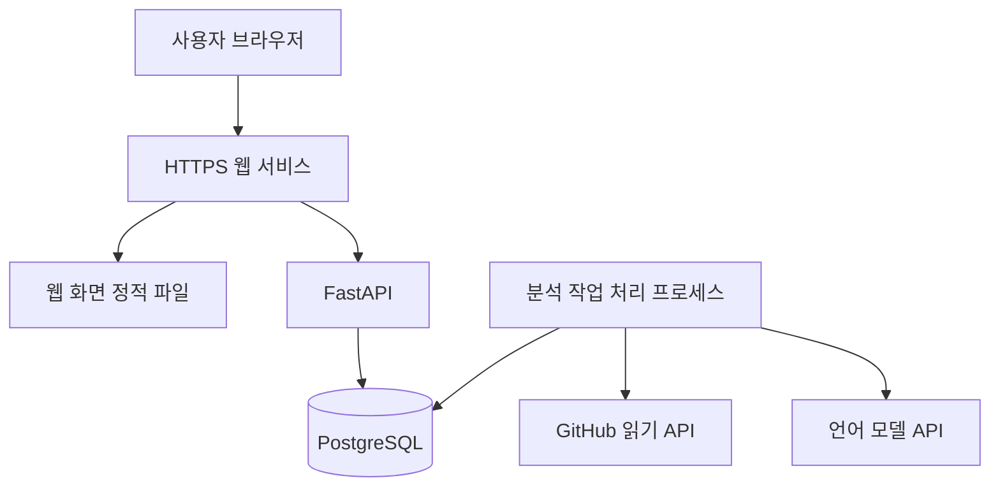

# GitHub 프로젝트 해설 및 포트폴리오 정리 도구 구현 명세서

- 문서 버전: 0.3 — 로컬 MVP 구현 상태와 후속 범위 연결
- 작성일: 2026-09-16
- 문서 목적: 구현 전에 기능 범위, 화면 동작, 분석 원칙, 서버 구조와 완료 기준을 함께 검토한다.
- 관련 문서: [AGENTS.md](./AGENTS.md), [UI_DESIGN.md](./UI_DESIGN.md), `수행평가4_과제 안내.docx`
- 최종 갱신: 2026-09-17
- 현재 단계: 로컬 MVP 구현·검증 후 사용자 확인. 공개 배포는 사용자의 로컬 검토 이후 진행한다.
- 실제 구현·시험 상태: [진행 기록](docs/IMPLEMENTATION_STATUS.md), [실행 및 사용법](README.md). 아래 설계 제안 전체를 구현 완료한 것은 아니며, API 초안보다 실행 코드와 개발 환경의 `/api/docs`가 실제 계약의 기준이다.

현재 구현은 React/TypeScript, FastAPI, SQLAlchemy, Alembic, 별도 DB 큐 worker를 사용한다. 로컬 DB는 SQLite이고 PostgreSQL 배포 구성은 준비했다. 실제 Gemini `gemini-3.5-flash-lite`의 도구 선택·상세 설명 생성·코멘트 반영을 검증했다. 시스템 초기 분류는 폴더 중심 규칙이며 의미 기반 AI 재분류, 스타일 기반 참여자 군집화, 공개 운영의 보존·IP 제한과 외부 접속 검증은 남아 있다. 구체적인 차이와 검증 근거는 진행 기록에 유지한다.

검토 순서는 [제품 목적과 범위](#1-제품-목적과-결정-상태), [화면 흐름](#3-사용-흐름과-화면), [분석 방식](#5-코드-구조와-담당-범위-분석), [코멘트 반영](#7-코멘트-반영과-버전-관리), [기술 구성](#8-권장-기술-구성과-서버-구조), [검증 기준](#15-검증-및-인수-기준), [미정 사항](#17-초안-검토-후-결정할-사항) 순으로 권장한다.

## 1. 제품 목적과 결정 상태

이 도구는 사용자가 예전에 개발한 GitHub 프로젝트를 다시 이해하고, 본인의 구현 내용과 기여를 포트폴리오로 정리하도록 돕는다. AI가 코드를 시스템별로 설명하면 사용자가 설명에 코멘트를 남긴다. 도구는 그 코멘트를 반영해 설명을 수정하고, 검토한 내용을 포트폴리오 문서로 정리한다.

완성 결과물은 공개된 서비스 URL로 접속하여 사용할 수 있는 웹 애플리케이션이다. 방문자는 프로그램 설치나 로컬 서버 실행 없이 저장소 링크와 본인의 GitHub 아이디를 입력할 수 있어야 한다.

### 1.1 문서의 상태 표시

| 표시 | 의미 |
| --- | --- |
| 확정 | 사용자와의 대화 또는 과제 안내에서 확인한 요구사항 |
| 제안 | 이번 초안에서 제시하는 구현 방법과 초기 범위. 검토 후 조정 가능 |
| 미정 | 구현 전에 추가로 결정할 사항 |

별도 표시가 없는 기술 설계는 모두 제안이다. 요구사항의 목적은 유지하되, 기술과 세부 화면은 변경할 수 있다.

### 1.2 확정된 요구사항

| ID | 요구사항 | 완료를 판단할 핵심 동작 |
| --- | --- | --- |
| R01 | GitHub 저장소 링크 입력 | 입력한 저장소의 실제 코드를 가져온다. |
| R02 | 본인 GitHub 아이디 직접 입력 및 수정 | 특정 계정을 고정하지 않고 입력값으로 기여 분석을 수행한다. |
| R03 | 개인 또는 팀 프로젝트 선택 | 선택한 유형에 맞게 담당 범위를 설정한다. |
| R04 | 참여자 및 담당 영역 구분 보조 | 네임스페이스, 코드 스타일, 작성 이력 등을 단서로 후보를 제시하고 사용자가 수정한다. |
| R05 | 시스템별 코드 해설 | 역할, 구체적인 클래스·데이터·연결 방식, 근거가 있는 설계 선택과 확장 방식을 연결된 문단으로 설명한다. |
| R06 | 설명에 코멘트 작성 | 사용자가 실제 담당 부분, 개발 의도, 강조할 내용과 해석 오류를 보완한다. |
| R07 | 코멘트 반영 | 사용자가 지정한 방향에 따라 해당 설명을 수정한다. |
| R08 | 포트폴리오 작성 지원 | 보완한 내용을 구현 방식과 본인 기여를 중심으로 정리한다. |
| R09 | 웹 배포 | 다른 기기에서 URL만으로 서비스에 접속하여 실제 기능을 사용한다. |
| R10 | 에이전트 서버 | 등록된 도구와 도구 선택·실행 로직을 실제 기능에 사용한다. |
| R11 | 과제 제출 준비 | 코드, 실행 화면, 개발 문서, 실사용 후기, 게시 링크, GitHub 링크를 준비한다. |
| R12 | UI 자료 활용 | 웹에서 레퍼런스와 재사용 가능한 컴포넌트 등을 검색하여 활용할 수 있다. |

### 1.3 첫 검증에 사용할 프로젝트

- 공개 저장소: [gominsu08/2025_Engine_TeamProject](https://github.com/gominsu08/2025_Engine_TeamProject)
- 사용자 본인이 확인한 GitHub 아이디: `gominsu08`
- 최초 확인 브랜치: `main`
- 초기 확인에서 `Assets/GMS/Code`, `Assets/PSW/Code`와 외부 라이브러리 코드가 함께 존재했다.
- 대표 코드에는 타일 확장, 기계 건설·관리, 자원 관리 기능이 확인된다. 이는 시스템 분류의 검증 사례로 사용한다.
- `GMS` 폴더 전체가 사용자 작성 코드라는 사실까지 확인된 것은 아니다. 아이디와 실제 담당 범위의 연결은 별도 검토 대상이다.
- 이 저장소와 아이디는 샘플 데이터다. 일반 서비스 로직에 이름이나 폴더 경로를 고정하지 않는다.

## 2. 첫 버전의 범위

### 2.1 우선 구현할 범위 제안

초기 버전은 공개 GitHub 저장소에 있는 Unity/C# 코드 분석에 집중한다. 사용자가 자료를 입력하고, 분석 결과를 검토하고, 코멘트를 반영한 뒤 Markdown 문서를 받는 흐름을 끝까지 완성한다.

| 영역 | 첫 버전에 포함할 기능 |
| --- | --- |
| 저장소 | 공개 저장소, 기본 브랜치 또는 지정한 브랜치·태그, 분석 시점 고정 |
| 코드 | C# 소스의 구조 분석, README 및 패키지 정보의 보조 활용 |
| 분석 대상 | 포함·제외 폴더 조정, 외부 라이브러리·생성 코드 분류 후보 확인 |
| 담당 범위 | 본인 아이디 조회, 후보 근거 표시, 파일·시스템 단위 수동 보정 |
| 시스템 | 자동 분류 초안, 이름 수정, 파일 소속 조정 |
| 설명 | 시스템 역할, 주요 구성 요소, 동작 흐름, 관련 코드, 확인할 사항 |
| 코멘트 | 시스템 또는 설명 문단에 코멘트, 선택한 코멘트 반영, 설명 버전 보존 |
| 결과 | 프로젝트별 저장, 시스템별 검토 완료 표시, Markdown 내보내기 및 복사 |
| 운영 | 분석 진행 표시, 실패·부분 완료 표시, 재시도·취소, 사용 한도 적용 |

### 2.2 후속 버전 후보

비공개 저장소 인증, 정식 회원가입, 여러 기기 간 프로젝트 동기화, C# 외 언어, Unity 씬·프리팹 참조 해석, 상세 Git blame, 과거 버전 간 변화 비교, PDF·DOCX 출력은 후속 후보로 둔다. 사용자의 필요와 제출 일정에 따라 일부를 앞당길 수 있다.

게임 빌드 실행, 자동 플레이, 소스 수정·커밋·PR 생성, 포트폴리오 자동 게시, 성과 수치 자동 추정은 첫 버전 범위에 포함하지 않는다. 저장소의 내용은 읽어서 분석하는 용도로 사용한다.

## 3. 사용 흐름과 화면

### 3.1 전체 흐름


첫 화면에는 예제 저장소로 체험할 수 있는 버튼을 제공한다. 예제를 선택한 경우에도 입력값을 수정할 수 있다. 준비된 예시 화면을 보여주는 경우 실제 분석 결과와 구별하여 표시한다.

### 3.2 프로젝트 등록 화면

| 입력 항목 | 동작 |
| --- | --- |
| GitHub 저장소 URL | 필수. 저장소 이름과 공개 여부를 확인한다. |
| 본인 GitHub 아이디 | 필수. 앞뒤 공백과 선행 `@`를 정리하고 조회 결과를 보여준다. |
| 프로젝트 유형 | 개인 / 팀 중 선택한다. 기본값은 사용자가 명시적으로 선택하도록 비워둔다. |
| 분석 버전 | 기본 브랜치를 기본값으로 사용한다. 필요하면 브랜치·태그를 변경한다. |
| 프로젝트 표시 이름 | 저장소 이름을 기본값으로 제공하고 수정할 수 있게 한다. |

주요 버튼은 `저장소 확인`, `분석 범위 확인`이다. 입력한 아이디는 본인 기여를 찾아보기 위한 기준이며 로그인이나 계정 소유 인증으로 사용하지 않는다.

아이디가 기여자 목록에 없더라도 저장소 확인을 막지 않는다. 과거 계정, 다른 Git 작성자 이름 또는 공동 작업 가능성을 안내하고 담당 범위를 직접 지정할 수 있게 한다. 존재하지 않는 아이디는 오타 확인을 요청하되, 사용자가 명시적으로 수동 지정 모드를 선택하면 분석을 진행할 수 있다.

### 3.3 분석 범위 및 담당 후보 화면

- 폴더 트리, 분석할 C# 파일 수, 제외 파일 수, 제외 사유를 표시한다.
- 파일을 `프로젝트 코드 후보`, `외부 라이브러리 후보`, `자동 생성 후보`, `확인 필요`로 구분한다.
- 사용자는 폴더와 파일을 포함하거나 제외하고 분류를 수정할 수 있다.
- 팀 프로젝트에서는 GitHub 계정과 코드 묶음의 연결 후보 및 근거를 보여준다.
- 담당 상태는 `본인 담당으로 지정`, `다른 참여자`, `공동 작업`, `확인 필요`로 둔다. 자동 후보와 사용자 지정은 별도 표시한다.
- 개인 프로젝트도 외부 라이브러리와 자동 생성 파일을 본인 구현으로 일괄 처리하지 않는다.
- 분석 범위를 확인한 뒤 `시스템 분석 시작`을 누른다. 한도를 초과하면 범위를 줄이는 방법을 제공한다.

### 3.4 분석 진행 화면

진행 단계를 `파일 수집`, `코드 구조 정리`, `작성 이력 확인`, `시스템 분류`, `설명 작성`, `근거 검증`으로 표시한다. 파일 처리 개수처럼 측정 가능한 진행 상황을 우선 보여주고, 근거 없는 완료 예상 시간을 표시하지 않는다.

브라우저를 새로 고쳐도 서버의 작업 상태를 다시 조회한다. 일부 파일 또는 시스템에 문제가 생기면 성공한 결과를 유지하며 실패 범위와 재시도 버튼을 제공한다. API 키나 내부 오류 스택은 방문자 화면에 노출하지 않는다.

### 3.5 분석 작업 화면

| 영역 | 표시 내용 및 동작 |
| --- | --- |
| 상단 | 프로젝트명, 분석 버전, 개인·팀 유형, 본인 아이디, 분석 범위 요약 |
| 왼쪽 | 시스템 목록, 담당 범위 필터, 설명 생성·검토 상태, 이름 수정 |
| 가운데 | 짧은 도입 요약, 설계 선택과 구현 방식을 구체적으로 풀어쓴 본문, 구성 요소·동작 흐름, 근거 코드 링크, 확인이 필요한 부분 |
| 오른쪽 | 선택한 문단의 코멘트, 시스템 전체 코멘트, 수정 요청 및 반영 내역 |

근거 링크를 누르면 같은 화면의 코드 패널에서 파일명과 해당 줄을 보여준다. GitHub 원문도 열 수 있다. 코드 패널은 설명과 코멘트의 읽기 위치를 잃지 않도록 닫았다가 다시 열 수 있어야 한다.

설명에는 `코드에서 확인`, `작성 이력에서 확인`, `사용자 설명`, `AI 추정`, `확인 필요`를 구분하여 표시한다. 이 표시는 AI의 신뢰도를 임의의 퍼센트로 나타내는 용도가 아니다.

### 3.6 코멘트 및 결과 화면

- 사용자는 시스템 전체 또는 특정 문단을 대상으로 코멘트를 작성한다.
- 코멘트 유형은 담당 범위, 개발 의도, 강조점, 설명 오류, 기타로 구분하되 선택을 강제하지 않는다.
- 저장과 AI 반영을 구분한다. 저장한 뒤 반영할 코멘트를 선택하고 `설명에 반영`을 누른다.
- 수정본에서는 변경된 내용, 사용한 코멘트, 아직 해결되지 않은 질문을 확인한다.
- 사용자는 이전 버전을 다시 볼 수 있고 현재 설명을 `검토 완료`로 표시할 수 있다.
- 내보내기 화면에서 시스템과 설명 버전을 고르고 Markdown을 미리 확인한다.
- 데스크톱에서는 세 영역을 함께 표시하고, 좁은 화면에서는 시스템·설명·코멘트를 탭으로 전환한다. 모든 주요 기능은 키보드로 조작할 수 있어야 한다.

## 4. 저장소 수집 명세

### 4.1 입력 검증과 분석 버전 고정

1. 첫 버전은 `https://github.com/{owner}/{repo}` 형태의 저장소 루트 URL을 받는다. 끝의 `/`와 `.git`은 정리한다.
2. URL에 인증정보가 들어 있거나 GitHub 이외 호스트를 가리키면 받지 않는다. 저장소 내부 파일 URL은 저장소 루트와 분석 버전으로 다시 입력하도록 안내한다.
3. GitHub 저장소 식별자, 공개 여부, 기본 브랜치와 입력한 ref의 존재를 확인한다.
4. 분석 시작 시 ref를 커밋 SHA로 해석해 고정한다. 파일, 작성 이력, 근거 링크는 모두 이 커밋을 기준으로 읽는다.
5. 브랜치 이름, 커밋 SHA, 트리 SHA, 확인 시각을 따로 저장한다. 브랜치가 바뀌어도 진행 중인 분석 자료가 섞이지 않아야 한다.

### 4.2 파일 목록과 내용 수집

GitHub REST API로 파일 트리를 조회하고 필요한 파일 내용만 가져온다. Unity 프로젝트 전체와 대형 에셋을 매번 복제하는 방식은 기본 수집 경로로 사용하지 않는다.

프로젝트를 등록하면 저장소 확인, ref 고정, 최초 파일 목록 수집까지 진행한다. 사용자가 분석 범위를 확인하고 분석을 시작하면 선택된 소스 원문을 수집한다. 새 ref의 분석은 새 스냅샷을 만들고, 같은 스냅샷에서 포함 범위만 변경하면 새 범위 설정 버전과 분석 실행을 만든다.

Git Trees API의 `truncated`가 참이면 하위 트리를 나누어 조회한다. 수집 한도 때문에 끝까지 조회하지 못한 경우 미수집 범위를 표시하고 부분 결과로 처리한다. GitHub의 재귀 트리 응답에는 항목 수와 응답 크기 제한이 있으므로 이 플래그를 확인해야 한다. [Git Trees 공식 문서](https://docs.github.com/en/rest/git/trees#get-a-tree)

파일 내용은 고정한 커밋 또는 blob SHA를 기준으로 가져온다. GitHub Contents API의 파일 크기와 응답 형식 제한을 고려하고, 분석에 필요한 텍스트만 디코딩한다. [Contents 공식 문서](https://docs.github.com/en/rest/repos/contents#get-repository-content)

### 4.3 파일 처리 규칙

| 종류 | 기본 처리 |
| --- | --- |
| `.cs` | 분석 대상. 자동 생성·외부 라이브러리 여부를 추가 분류 |
| README, `Packages/manifest.json`, Unity 버전 파일 | 프로젝트 설명과 사용 기술의 보조 자료 |
| `.meta`, 씬, 프리팹, ScriptableObject 직렬화 파일 | 첫 버전의 상세 분석 대상에서 제외하고 제외 범위를 표시 |
| 이미지, 오디오, 영상, 모델, 바이너리 | 내용 다운로드 및 AI 입력에서 제외 |
| Git LFS 포인터, 서브모듈, 심볼릭 링크 | 별도 항목으로 기록하고 연결된 파일을 자동 추적하지 않음 |
| 비정상 인코딩, 크기 초과 파일 | 사유를 기록하고 부분 분석 결과에 표시 |

UTF-8 및 BOM을 우선 처리하고, CP949 등 추가 인코딩은 명시된 지원 목록으로 처리한다. 자동 판별이 불확실하면 깨진 텍스트를 정상 코드처럼 분석하지 않는다. 원본 줄 번호와 파서의 줄 번호 변환 규칙을 고정한다.

분석 대상에 포함된 파일만 코드 설명에 사용한다. 외부 라이브러리의 이름과 호출 관계는 보조 정보로 남길 수 있지만, 라이브러리 전체 구현을 사용자의 성과로 정리하지 않는다.

## 5. 코드 구조와 담당 범위 분석

### 5.1 C# 구조 추출

Tree-sitter의 C# 문법과 Python 바인딩을 사용한 구문 분석을 제안한다. 네임스페이스, 타입, 상속 표기, 메서드, 필드, 프로퍼티, 속성, 이벤트와 호출 표현을 파일·줄 위치와 함께 추출한다. [C# 문법](https://github.com/tree-sitter/tree-sitter-c-sharp), [Python 바인딩](https://github.com/tree-sitter/py-tree-sitter)

구문 트리만으로 완전한 타입 해석이 된다고 가정하지 않는다. 동명 메서드, 확장 메서드, 제네릭, 조건부 컴파일, 리플렉션, 외부 어셈블리 참조는 해석되지 않거나 여러 후보가 남을 수 있다. 관계는 `구문상 확인`, `이름 기반 후보`, `해석 불가`로 구분한다.

Unity의 `[SerializeField]`, `UnityEvent`, 인스펙터 연결, 프리팹 연결은 코드만으로 실제 실행 연결을 확정하기 어렵다. 첫 버전에서는 코드에 나타나는 참조와 가능성까지만 설명한다. 씬이나 게임을 실행해 검증했다는 표현을 만들지 않는다.

### 5.2 시스템 분류

1. 폴더, 네임스페이스, 타입 이름과 추출한 참조 관계로 초기 묶음을 만든다.
2. AI가 필요한 코드와 관계 정보를 도구로 확인하여 기능 이름과 경계를 제안한다.
3. 각 파일에는 기본 소속 시스템 하나를 부여하고, 여러 시스템에서 쓰는 공통 코드와 참조 관계를 별도로 표시한다.
4. 독립된 근거가 부족한 묶음은 억지로 이름을 붙이지 않고 미분류로 남긴다.
5. 사용자가 이름과 파일 소속을 수정하면 시스템 구성 버전을 올리고 영향을 받는 설명을 재검토 대상으로 표시한다.

분류 결과에 있는 파일 ID가 선택한 범위에 존재하는지 검증한다. 각 선택 파일에는 기본 소속 시스템 또는 미분류 상태가 있어야 하며, 소속을 잃거나 여러 기본 시스템에 중복 배정되는 결과를 저장하지 않는다. 여러 곳에서 사용하는 코드는 별도의 참조 관계로 연결한다.

샘플 저장소의 초기 후보는 타일·맵, 기계·생산, 유닛·운반, 자원·거래, UI·입력 등이다. 이는 초기 확인과 파일 구조를 바탕으로 한 후보이며, 실제 분석에서 코드 근거를 확인해야 한다.

### 5.3 담당 범위 추정

| 근거 | 사용할 수 있는 정보 | 처리 원칙 |
| --- | --- | --- |
| GitHub 계정과 커밋 author | 입력한 계정과 연결되는 변경 이력 | 작성된 변경의 근거로 사용하고 전체 설계 기여로 확대하지 않음 |
| 파일별 변경 이력 | 어떤 시점에 어떤 변경에 참여했는지 | 커밋 작성자와 병합 실행자를 구분하고 조사 범위를 표시 |
| 네임스페이스·폴더 | 코드가 조직된 방식 | 사람 이름과의 대응은 후보로 제시 |
| 코드 스타일 | 명명법, 필드 표기, 괄호·들여쓰기 등 공통 특징 | 초기 버전은 보조 지표만 사용. 스타일만으로 인원수나 신원을 확정하지 않음 |
| 사용자 지정 | 실제 담당 부분, 공동 작업, 과거 계정 | 사용자 제공 정보로 저장하고 자동 추정과 구분 |

Git의 줄 단위 이력도 기본적으로 마지막 수정에 관한 정보다. 파일의 최초 작성자나 아이디어의 소유자를 자동으로 증명하지 않는다. 상세 blame 기능은 후속 후보이며, 첫 버전은 커밋·파일 변경 이력과 사용자 보정을 우선한다. [git blame 공식 설명](https://git-scm.com/docs/git-blame)

같은 사람이 여러 계정을 사용했다는 연결은 사용자가 직접 확인하도록 한다. 공유 계정이나 가져온 외부 코드처럼 근거가 모호한 항목은 `공동 작업` 또는 `확인 필요`로 남긴다. 커밋 수, 변경 줄 수 또는 파일 수를 전체 기여도 퍼센트로 변환하지 않는다.

파일 변경 이력은 고정된 커밋에서 도달할 수 있는 이력을 기준으로 조회한다. 파일 이동·이름 변경 이전의 이력을 모두 추적하지 못했거나 조회 한도에 도달하면 조사 범위에 기록한다. 개인 프로젝트 선택으로 지정한 담당 정보도 사용자 설정이라는 출처를 유지한다.

GitHub 아이디나 개인·팀 유형을 바꾸면 담당 분석 설정 버전을 올린다. 이미 수집한 같은 커밋의 코드는 재사용할 수 있지만, 기여 설명과 관련 포트폴리오 문장은 재검토 대상으로 바뀌어야 한다.

## 6. AI 에이전트와 설명 생성

### 6.1 처리 방식

별도의 AI 모델을 직접 학습시키는 작업은 첫 버전에 포함하지 않는다. 외부 언어 모델 API, 직접 구현하는 코드 분석 기능, 저장소 조회 도구를 조합한다. 모델 제공자와 모델 이름은 미정이며, 교체 가능한 어댑터로 분리한다.

파일 수집·구문 분석·줄 번호 검증은 서버 코드가 수행한다. 시스템 해석과 설명 작성 단계에서는 AI가 등록된 도구 중 필요한 것을 선택한다. AI에 저장소 전체를 한 번에 전달하는 방식은 기본 동작으로 사용하지 않는다.

### 6.2 도구 등록 규격

각 도구에는 `name`, `description`, `input_schema`, `output_schema`, `handler`, `timeout`, `cost_class`를 등록한다. 실행기는 허용된 도구 이름과 입력 형식을 검사하고, 현재 프로젝트·분석 버전의 접근 범위를 서버에서 주입한다.

| 도구 | 주요 입력 | 주요 결과 | 선택되는 상황 |
| --- | --- | --- | --- |
| `list_source_files` | 폴더, 분류, 페이지 | 파일 ID·경로·크기·분석 상태 | 코드 위치와 분석 범위 파악 |
| `read_code` | 파일 ID, 시작·끝 줄 | 코드와 검증 가능한 근거 ID | 특정 구현 내용을 확인 |
| `search_symbols` | 이름 또는 검색어, 시스템 범위 | 타입·메서드·필드 후보와 위치 | 관련 구성 요소 탐색 |
| `get_symbol_relations` | 심볼 ID, 방향, 깊이 | 참조·호출 후보와 확인 수준 | 시스템 간 연결 설명 |
| `get_file_history` | 파일 ID, 기간·페이지 한도 | 고정한 커밋 이전의 변경 이력 | 담당 범위나 변화 과정 확인 |
| `get_attribution_evidence` | 파일·시스템 ID | 자동 후보, 근거, 사용자 지정 | 본인 기여에 관한 설명 |
| `get_review_context` | 시스템 ID, 기준 설명 버전 | 코멘트, 사용자 제공 정보, 미해결 항목 | 코멘트 반영 및 설명 수정 |

AI에는 저장소 코드 실행, 셸 명령 실행, 임의 URL 접근, Git 쓰기, 데이터베이스 임의 질의 도구를 제공하지 않는다. 도구는 기존 분석 자료와 허용된 GitHub 조회만 사용한다. 설명을 저장하는 작업은 AI의 임의 호출이 아니라 결과 검증 후 서버가 수행한다.

### 6.3 도구 선택과 실행 절차

1. 서버가 작업 목적, 대상 시스템, 사용 가능한 도구, 관련 파일 요약, 남은 한도를 전달한다.
2. AI는 도구 호출을 요청하거나 구조화된 최종 설명을 반환한다.
3. 실행기는 도구 이름·인자·프로젝트 범위·한도를 확인한 후 실행한다.
4. 도구 결과에는 데이터, 근거 ID, 잘림 여부, 실패 사유를 포함한다.
5. AI는 부족한 근거가 있으면 추가 조회한다. 필요한 자료가 없으면 확인할 사항으로 남긴다.
6. 서버는 최종 JSON 형식과 근거 연결을 검증한다. 잘못된 결과는 제한된 횟수만 재생성한다.
7. 검증된 결과를 새 설명 버전으로 저장하고 작업 상태를 갱신한다.

예를 들어 역할 설명에는 코드와 심볼 관계를, 본인 변경 사항을 묻는 요청에는 작성 이력을 추가로 선택해야 한다. 모든 요청에 같은 도구를 같은 순서로 호출하는 구현으로 에이전트 선택 기능을 대체하지 않는다.

도구 실행 기록에는 이름, 정리된 입력, 성공·실패, 참조한 자료, 소요 시간만 남긴다. 화면에는 `TileManager.cs 확인`, `관련 이벤트 확인`처럼 사용자가 이해할 수 있는 작업 내역을 보여준다.

### 6.4 시스템 설명의 공통 구성

| 항목 | 작성 내용 |
| --- | --- |
| 역할 | 해당 시스템이 게임에서 하는 일 |
| 주요 구성 | 핵심 클래스·메서드와 각각의 책임 |
| 동작 흐름 | 입력, 이벤트, 상태 변경, 결과의 연결 |
| 다른 시스템과의 관계 | 사용하는 데이터와 연결 대상, 해석의 한계 |
| 구현 특징 | 코드에서 확인되는 구현 방식과 기술적 선택 |
| 본인 기여 | 작성 이력 및 사용자 지정으로 확인·보완한 범위 |
| 개발 배경 | 사용자 설명이나 명시된 기록이 있는 경우에만 작성 |
| 확인할 사항 | 담당 범위, 설계 의도, 실행 연결 등에 남아 있는 질문 |

#### 6.4.1 설명의 구체성과 서술 형식

사용자는 기능 이름과 역할을 몇 줄로 나열하는 수준보다, 본인이 어떤 구조로 개발했는지 다시 떠올릴 수 있는 설명을 원한다. **구체적인 설계 선택 → 이를 구현한 클래스와 데이터 → 실제로 동작·확장하는 방식**이 연결되도록 작성한다. 분량 자체를 늘리기보다 각 문장에 코드나 사용자 경험의 구체적인 내용을 담는다.

- 시스템 이름 아래에는 짧은 도입 요약을 둘 수 있지만, 기본 화면에서 상세 본문도 함께 읽을 수 있어야 한다.
- 하나의 핵심 구현 주제는 사용자 예시와 비슷한 2~3개 문단을 출발점으로 삼는다. 문단 수는 고정 합격 조건이 아니며 코드의 복잡성과 근거의 양에 따라 조절한다.
- `확장성이 좋다`고만 쓰지 않고, 어떤 구조로 무엇을 추가하거나 바꿀 수 있는지 설명한다. 예를 들어 상속을 통한 기능 확장과 SO 교체·설정을 통한 데이터 구분을 나눠 다룬다.
- 클래스·메서드·설정 데이터는 실제 역할과 함께 설명한다. 이름 나열, 같은 의미의 반복, 교과서적인 장점만으로 분량을 채우지 않는다.
- 코드만으로 확인된 구조는 관찰한 사실로 서술한다. 당시 선택 이유나 본인이 개발했다는 표현은 사용자 설명·담당 확인이 있을 때 연결한다. 일반적으로 기대되는 장점과 실제로 달성한 성과를 혼동하지 않는다.
- 코멘트 반영과 포트폴리오 출력에서도 구체적인 구현 설명을 보존한다. 별도의 축약 요청이 없다면 한 줄 요약으로 줄이지 않는다.

다음은 **사용자가 제공한 내용에 기반한 문체·구체성 예시**다. 추상 클래스의 실제 이름, 상속 관계, SO 필드와 담당 범위가 저장소에서 모두 검증되었다는 뜻은 아니다.

> 추상 클래스 상속을 활용하여, 이후 새로운 기능을 가진 기계가 추가되더라도 확장할 수 있도록 개발하였습니다.
>
> 기본적으로 기계의 종류와 설정은 Machine 클래스에 어떤 SO(ScriptableObject)를 연결하느냐에 따라 결정됩니다. SO에는 기계의 종류와 티어, 일정 시간 동안 채집하는 자원의 양 등이 기록되어 있습니다.
>
> 이처럼 기능을 확장하는 상속 구조와 기계별 설정을 담은 데이터를 나누어, 기계의 종류와 채집 설정을 구분할 수 있도록 구성하였습니다.

### 6.5 설명 데이터 형식

최종 설명은 자유로운 Markdown 문자열 하나 대신 문단 ID와 주장·근거 목록을 포함하는 JSON으로 저장한다. 아래는 형식 예시이며, 실제 분석 결과나 실제 줄 번호를 뜻하지 않는다. 단일 문장은 스키마를 보여주기 위한 최소 예시이며 실제 출력의 길이 기준이 아니다. 실제 본문은 6.4.1의 구체성을 따르고 각 문단에 독립적인 block_id와 근거를 연결한다.

```json
{
  "schema_version": 1,
  "system_id": "system-id",
  "title": "타일 확장 시스템",
  "blocks": [
    {
      "block_id": "block-id",
      "section": "implementation_flow",
      "text": "타일 구매 이벤트를 받아 새 타일을 추가합니다.",
      "claim_ids": ["claim-id"]
    }
  ],
  "claims": [
    {
      "claim_id": "claim-id",
      "basis": "code_observation",
      "status": "supported",
      "evidence_ids": ["evidence-id"]
    }
  ],
  "open_questions": [],
  "applied_comment_ids": []
}
```

`basis`는 `code_observation`, `history_observation`, `user_statement`, `inference` 중 하나다. `status`는 `supported`, `needs_confirmation`, `conflicting` 중 하나다. 사용자가 설명을 검토했다는 상태는 별도 필드로 관리한다.

### 6.6 근거 및 내용 검증

- 코드 근거는 저장소 식별자, 커밋 SHA, 파일 경로, blob SHA, 시작·끝 줄과 연결한다.
- 인용된 파일과 줄 범위가 실제 스냅샷에 존재하는지 서버가 검사한다.
- 다른 커밋의 코드나 제외된 파일을 현재 분석의 근거로 연결하지 않는다.
- 구조 검사 통과는 설명 내용이 참이라는 보증과 다르다. 주장과 근거의 의미상 일치는 표본 검토와 사용자 검토로 확인한다.
- 설계 의도, 개발 순서, 성능 개선 수치, 오류 해결 경험은 해당 자료나 사용자 설명이 없으면 생성하지 않는다.
- 사용자 코멘트로 얻은 내용은 사용자 제공 정보로 보존한다. 코멘트가 추가되었다고 코드에서 검증된 사실로 바꾸지 않는다.
- 근거가 없는 결론을 삭제하거나 확인할 질문으로 바꾼다. 검증에 실패한 설명은 정상 완료 결과로 내보내지 않는다.

## 7. 코멘트 반영과 버전 관리

### 7.1 코멘트 저장

코멘트는 프로젝트, 시스템, 기준 설명 버전, 선택한 문단 ID와 함께 저장한다. 시스템 전체 코멘트는 문단 ID를 비워둘 수 있다. 코멘트를 수정하거나 삭제해도 이미 생성된 설명에 사용된 원문 사본과 연결 관계는 보존한다.

사용자가 입력 중인 내용은 임시 저장 상태와 서버 저장 완료 상태를 구별한다. 저장 실패 시 입력을 유지하고 재시도할 수 있게 한다.

### 7.2 코멘트 반영 동작

1. 사용자가 반영할 코멘트와 기준 설명 버전을 선택한다.
2. 서버는 현재 시스템 구성·담당 설정 버전과 기준 버전을 확인한다.
3. AI에는 기존 설명, 선택한 코멘트, 필요한 사용자 제공 정보와 코드 조회 도구를 전달한다.
4. 요청한 범위의 설명을 수정하되 기존의 유효한 근거와 다른 문단의 내용을 유지한다.
5. 새 설명 버전을 만들고 이전 버전, 반영한 코멘트, 변경 요약을 연결한다.
6. 성공한 뒤에만 코멘트의 반영 상태를 갱신한다. 실패하면 기존 설명과 코멘트를 유지한다.

예를 들어 사용자가 `이 부분은 공동 작업이고 나는 자원 연동 부분을 담당했어`라고 쓰면, 기여 설명을 해당 범위로 보완한다. 이를 근거로 관련 시스템 전체를 사용자 단독 구현으로 바꾸지 않는다.

### 7.3 충돌과 재검토

| 상황 | 동작 |
| --- | --- |
| 코멘트와 현재 코드가 다름 | 두 내용을 보존하고 다른 버전의 코드인지 등 확인할 질문을 표시 |
| 두 코멘트가 서로 다름 | 충돌한 내용을 표시하고 어떤 설명을 채택할지 사용자에게 선택받음 |
| 오래된 설명에서 수정 요청 | 기준 버전 불일치를 알리고 최신 내용 확인 또는 기존 버전에서 새 수정본 생성 |
| 문단이 삭제·재구성됨 | 코멘트를 원래 버전에 보존하고 새 문단의 연결은 재확인 |
| 시스템 구성이나 담당 아이디 변경 | 기존 설명을 재검토 대상으로 표시하고 관련 설명만 다시 생성 |
| 다른 커밋으로 재분석 | 새 스냅샷 생성. 이전 설명과 코멘트는 유지하고 재사용할 사용자 설명은 선택받음 |

설명 버전은 생성 후 본문을 덮어쓰지 않는다. `검토 완료`는 해당 버전과 설정에만 적용한다. 코드나 담당 설정이 바뀌면 이전 버전의 검토 상태를 새 설명에 자동 승계하지 않는다.

### 7.4 포트폴리오 출력

첫 출력 형식은 Markdown을 제안한다. 복사와 파일 다운로드를 모두 지원한다. 기본 구성은 프로젝트 개요, 본인 역할, 선택한 시스템의 구현 내용, 사용자 제공 개발 경험, 근거 코드 링크다.

시스템의 구현 내용에는 검토한 상세 설명 본문을 포함한다. 클래스 구조, 설정 데이터, 확장 방식에 대한 설명을 보존하며 도입 요약만 내보내지 않는다. 사용자에게 확인된 담당 범위와 개발 의도는 포트폴리오에 사용할 수 있는 서술형 문장으로 연결한다.

검토 완료된 최신 유효 버전을 기본 선택한다. 초안이나 재검토 대상 설명을 포함하려면 사용자가 이를 선택해야 하며 출력에도 해당 상태를 남긴다. 미해결 기여 충돌을 단정적인 1인칭 성과 문장으로 바꾸지 않는다.

내보내기는 선택한 설명 버전과 순서를 기록하여 재현 가능하게 한다. 저장소 URL, 분석 커밋, 작성 시점을 포함한다. 문서의 개인 기여 표현은 사용자 지정과 검토한 내용의 범위를 넘지 않아야 한다.

## 8. 권장 기술 구성과 서버 구조

### 8.1 기술 구성 제안

| 영역 | 제안 | 선택 이유 |
| --- | --- | --- |
| 웹 화면 | React, TypeScript, Vite | 시스템 탐색, 코드 패널, 코멘트 상태를 분리하여 구현 |
| UI | Tailwind CSS와 필요한 shadcn/ui 컴포넌트 | 입력·탭·대화상자 등 기본 요소를 일관되게 구성 |
| API 서버 | Python, FastAPI, Pydantic | 요청 검증, AI 도구 구현, 분석 파이프라인 연결 |
| 영속 저장 | PostgreSQL, SQLAlchemy, Alembic | 프로젝트·버전·코멘트·작업 상태 저장과 마이그레이션 |
| 코드 분석 | Tree-sitter와 C# 문법 | 실행 없이 구문과 위치 정보 추출 |
| 분석 실행 | 독립 Python 작업 처리 프로세스 | 브라우저 요청 종료 및 API 재시작과 분리 |
| AI 연결 | 공급자 교체가 가능한 `LLMClient` 어댑터 | 모델별 호출과 도구 호출·구조화 출력의 차이 격리 |
| 배포 | 컨테이너 기반 웹 서비스와 작업 처리 서비스 | 개발자 PC에 의존하지 않는 외부 접속 환경 구성 |

정확한 패키지 버전은 구현 시작 시 호환성을 확인하고 잠금 파일로 고정한다. 모델, 호스팅 제공자와 운영 예산은 미정이다. Python 개발 환경은 프로젝트 전용 conda 환경을 기본으로 하고 배포 런타임과의 차이를 문서화한다.

Vite 빌드 결과를 서버에서 제공하는 구성을 제안한다. 개발용 미리보기 서버를 운영 서버로 사용하지 않는다. shadcn/ui는 필요한 구성 요소만 채택한다. [Vite 배포 문서](https://vite.dev/guide/static-deploy.html), [shadcn/ui Vite 설치 문서](https://ui.shadcn.com/docs/installation/vite)

### 8.2 배포 구조



웹 화면과 API는 같은 출처의 URL을 사용한다. API 서버는 작업을 등록하고 상태를 반환하며, 장시간 분석은 별도 프로세스가 처리한다. 저장된 결과는 API를 통해 조회한다.

FastAPI의 간단한 `BackgroundTasks`만으로 핵심 분석을 유지하는 구성은 채택하지 않는다. 공식 문서도 별도 프로세스가 필요한 무거운 작업에서는 작업 처리 도구를 고려하도록 안내한다. 여기서는 구성 요소를 줄이기 위해 PostgreSQL 작업 테이블과 독립 처리 프로세스를 제안한다. [FastAPI 공식 문서](https://fastapi.tiangolo.com/tutorial/background-tasks/#caveat)

### 8.3 코드 구성 제안

```text
web/
  src/pages/           프로젝트 등록과 분석 작업 화면
  src/components/      시스템 목록, 설명, 코드 뷰어, 코멘트
  src/api/             API 요청과 응답 타입
server/
  app/api/             HTTP 라우트와 접근 범위 확인
  app/schemas/         요청·응답·AI 결과 검증
  app/services/        프로젝트, 버전, 내보내기 처리
  app/github/          저장소와 이력 조회
  app/analysis/        코드 분류, C# 파싱, 관계 추출
  app/agent/           도구 등록, 호출 실행, 설명 생성
  app/worker/          작업 실행, 재시도, 취소
  app/db/              데이터 모델과 저장 처리
  migrations/          데이터베이스 변경 이력
tests/
  fixtures/            검증용 소형 저장소와 기록된 API 응답
  unit/                규칙과 변환 검증
  integration/         서버·DB·외부 API 경계 검증
  e2e/                 실제 사용자 흐름 검증
docs/                  설치법, 개발 과정, 실사용 후기
```

## 9. 데이터 구조

### 9.1 주요 엔터티

| 엔터티 | 주요 필드 | 목적 |
| --- | --- | --- |
| `visitor_sessions` | ID, 세션 토큰 해시, 생성·만료 시각 | 방문자별 프로젝트 접근 구분 |
| `projects` | ID, 세션 ID, 저장소 식별자·URL, 본인 아이디, 개인·팀 유형, 설정 버전 | 사용자 작업 단위 |
| `snapshots` | ID, 프로젝트 ID, ref, 커밋·트리 SHA, 확인 시각, 수집 상태 | 고정된 코드 버전과 수집 자료 |
| `scope_versions` | ID, 프로젝트·스냅샷 ID, 포함·제외 파일, 분류 보정, 사유 | 변경되지 않는 분석 범위 설정 |
| `analysis_runs` | ID, 스냅샷·범위·담당 설정 버전, 모델·파서·프롬프트 버전, 작업 ID, 결과 상태 | 한 번의 분석에 사용한 설정과 결과 연결 |
| `source_files` | ID, 스냅샷 ID, 경로, blob SHA, 크기, 인코딩, 분류 후보, 원문, 처리 상태 | 수집한 코드와 분류 근거 |
| `git_commits` 및 `file_changes` | 커밋 SHA, 부모 SHA, author 계정, 시각, 메시지, 변경 경로·상태·근거 | 조회한 작성 이력과 조사 범위 보존 |
| `symbols` | ID, 파일 ID, 종류, 전체 이름, 서명, 줄 범위 | 클래스·메서드 등의 위치 |
| `symbol_relations` | 출발·도착 심볼, 종류, 확인 수준, 근거 위치 | 코드 연결 관계 |
| `attribution_evidence` | 파일·심볼 ID, 계정 후보, 근거 종류, 이력 참조, 조사 범위 | 자동 담당 후보 |
| `attribution_rules` | 프로젝트 ID, 대상, 담당 상태·계정, 사용자 설명, 버전 | 사용자가 지정한 담당 범위 |
| `systems` 및 `system_versions` | 안정된 시스템 ID, 분석 실행 ID, 구성 버전, 이름, 소속 파일, 공통 참조 | 시스템 분류 및 수정 이력 |
| `evidence` | ID, 근거 종류, 스냅샷·파일·줄 또는 이력·코멘트 참조 | 설명의 출처 |
| `explanation_revisions` | ID, 시스템 버전, 기준 설정 버전, 부모 버전, JSON 본문, 검토 상태 | 설명 버전 |
| `comments` 및 `comment_versions` | ID, 시스템·설명·문단 ID, 내용, 유형, 작성 시각, 수정 이력 | 사용자 코멘트 보존 |
| `revision_comments` | 설명 버전 ID, 반영한 코멘트 버전 ID | 어떤 코멘트로 수정했는지 연결 |
| `jobs` | ID, 작업 종류, 대상, 상태, 단계, 재시도, 한도, lease 정보 | 장시간 작업 관리 |
| `tool_runs` | 작업 ID, 순서, 도구 이름, 정리된 입력·결과 참조, 실행 시간, 오류 | 도구 실행 검증 |
| `exports` | ID, 프로젝트 ID, 선택한 설명 버전, 형식, 파일 내용, 생성 시각 | 내보내기 결과 재현 |

### 9.2 일관성 규칙

- 서로 다른 프로젝트의 시스템·근거·코멘트를 연결하지 못하도록 서버 검증과 외래 키를 적용한다.
- 같은 스냅샷의 경로는 유일해야 한다. 경로만 같고 커밋이 다른 코드는 같은 분석 자료로 취급하지 않는다.
- 설명은 스냅샷, 시스템 구성 버전, 담당 설정 버전, 모델·프롬프트 버전을 기록한다.
- 코드 원문은 설정한 수집 한도 안에서 DB에 저장하는 방식을 제안한다. 대형 파일 저장 서비스는 첫 버전에 추가하지 않는다.
- 새 버전 생성과 코멘트 반영 상태 변경은 하나의 트랜잭션으로 처리한다.
- 범위·담당 설정은 수정할 때 새 버전을 만든다. 이전 분석 실행과 설명이 참조하는 설정을 덮어쓰지 않는다.
- 작업 시작 후 설정이 변경되어도 해당 작업은 시작 당시의 설정으로 결과를 보존한다. 완료 시 현재 설정과 다르면 최신 결과로 자동 채택하지 않고 재검토 대상으로 표시한다.
- 프로젝트 삭제 시 실행 작업을 취소하고 해당 세션의 코드 사본·설명·코멘트·출력물을 함께 정리한다. 다른 프로젝트의 데이터는 유지한다.
- 샘플 저장소 자료와 사용자가 새로 입력한 자료는 같은 데이터 구조를 사용한다.

## 10. HTTP API 명세 초안

### 10.1 공통 규칙

- 기본 경로는 `/api/v1`이며 JSON을 사용한다. 식별자는 서버에서 생성한다.
- 방문자 세션 쿠키로 프로젝트 접근을 확인한다. 본인 GitHub 아이디는 접근 권한 판단에 사용하지 않는다.
- 장시간 작업은 `202 Accepted`와 작업 ID를 반환하고 결과를 별도로 조회한다.
- 생성·분석·수정 반영 요청에는 `Idempotency-Key`를 지원하여 같은 요청의 중복 작업 등록을 막는다. 키는 세션과 요청 내용에 연결한다.
- 설정 수정에는 `expected_version`, 설명 수정에는 `base_revision_id`를 사용한다. 버전이 다르면 `409 Conflict`와 현재 버전을 반환한다.
- 목록 조회에는 페이지 크기와 다음 커서를 사용한다. ID만 바꿔 다른 세션 자료를 조회할 수 없어야 한다.
- 외부 API의 오류 메시지와 비밀값을 그대로 반환하지 않는다. 사용자용 설명, 오류 코드, 재시도 가능 여부, 요청 추적 ID를 반환한다.

### 10.2 엔드포인트

아래 표의 `{p}`는 프로젝트 ID, `{s}`는 시스템 ID, `{j}`는 작업 ID다. 모든 프로젝트 하위 리소스는 접근 가능한 프로젝트에 실제로 속하는지 확인한다.

| 메서드와 경로 | 역할 | 핵심 결과 |
| --- | --- | --- |
| `POST /session` | 익명 세션 시작 또는 재사용 | 세션 쿠키, 만료 정보 |
| `GET /projects` | 현재 세션의 프로젝트 목록 | 프로젝트와 최근 작업 상태 |
| `POST /projects` | 입력 저장, 최초 스냅샷 및 파일 목록 확인 작업 등록 | 프로젝트 ID, 작업 ID |
| `GET /projects/{p}` | 프로젝트 요약 조회 | 설정, 현재 스냅샷, 분석 범위 |
| `PATCH /projects/{p}` | 이름·아이디·유형 수정 | 새 설정 버전과 재검토 대상 |
| `DELETE /projects/{p}` | 프로젝트 삭제 작업 등록 | 삭제 작업 ID |
| `POST /projects/{p}/snapshots` | 선택한 ref의 새 자료 수집 | 스냅샷·작업 ID |
| `GET /projects/{p}/files` | 파일 목록·분류·제외 사유 | 페이지 단위 목록 |
| `GET /projects/{p}/files/{file_id}` | 고정 스냅샷의 코드 조회 | 파일 정보, 요청한 줄 범위 |
| `PATCH /projects/{p}/scope` | 포함·제외 파일과 분류 변경 | 범위 설정 버전 |
| `GET /projects/{p}/contributors` | 참여 계정과 이력 범위 조회 | 계정 후보, 조회 완료 범위 |
| `PUT /projects/{p}/attribution-rules` | 담당 범위 수동 지정 | 새 담당 설정 버전 |
| `POST /projects/{p}/analyses` | 시스템 분류 및 설명 생성 | 분석 작업 ID |
| `GET /projects/{p}/systems` | 시스템 목록 | 분류와 설명·검토 상태 |
| `PATCH /projects/{p}/systems/{s}` | 시스템 이름·소속 파일 수정 | 구성 버전, 영향받는 설명 |
| `GET /projects/{p}/systems/{s}/revisions` | 설명 버전 조회 | 최신 설명과 버전 목록 |
| `POST /projects/{p}/systems/{s}/comments` | 코멘트 저장 | 코멘트 ID와 저장 버전 |
| `GET /projects/{p}/systems/{s}/comments` | 코멘트와 반영 이력 조회 | 코멘트 목록 |
| `PATCH /projects/{p}/comments/{comment_id}` | 코멘트 수정·삭제 표시 | 코멘트의 새 버전 |
| `POST /projects/{p}/systems/{s}/revisions` | 선택한 코멘트로 설명 수정 | 수정 작업 ID |
| `PATCH /projects/{p}/revisions/{revision_id}/review` | 해당 설명 검토 상태 변경 | 검토 상태와 대상 버전 |
| `GET /jobs/{j}` | 작업 진행·오류·결과 조회 | 상태, 단계, 완료·실패 범위 |
| `POST /jobs/{j}/cancel` | 작업 취소 요청 | 취소 요청 상태 |
| `POST /jobs/{j}/retry` | 재시도 가능한 실패 작업 재개 | 새 시도 정보 또는 작업 ID |
| `POST /projects/{p}/exports` | 선택한 설명을 문서로 생성 | 출력 ID 또는 작업 ID |
| `GET /projects/{p}/exports/{export_id}` | 미리보기 또는 다운로드 | Markdown과 생성 기준 |

범위 수정 요청은 `snapshot_id`, `expected_version`, 포함·제외 변경 목록과 분류 보정을 받는다. 담당 지정 요청은 기준 버전과 함께 파일 또는 시스템 ID, 담당 상태, 계정 목록, 사용자 설명을 받는다. 시스템 구성 수정은 기준 구성 버전, 이름, 기본 소속 파일 ID를 받는다. 서로 다른 스냅샷의 ID를 섞은 요청은 거부한다.

분석 시작 요청은 `snapshot_id`, `scope_version_id`, `attribution_version_id`를 명시한다. 내보내기 요청은 설명 버전 ID의 순서 있는 목록, `format`, 초안 포함 여부를 받는다. 파일 다운로드 여부는 조회 옵션으로 구분한다. 작업 조회 결과에는 `status`, `stage`, 처리 개수, 실패·제외 범위, 결과 ID, 오류 코드, 재시도 시각을 포함한다.

### 10.3 요청과 응답 예시

프로젝트 등록 예시에서 아이디는 테스트 데이터이며 실제로는 화면 입력값을 사용한다.

```json
{
  "repository_url": "https://github.com/gominsu08/2025_Engine_TeamProject",
  "github_username": "gominsu08",
  "project_mode": "team",
  "ref": "main"
}
```

코멘트 반영 요청은 대상 설명과 코멘트 버전을 명시한다.

```json
{
  "base_revision_id": "revision-id",
  "expected_system_version": 2,
  "expected_attribution_version": 3,
  "comment_versions": [
    {"comment_id": "comment-id", "version": 1}
  ]
}
```

공통 오류 응답 형식은 다음과 같다.

```json
{
  "error": {
    "code": "REVISION_CONFLICT",
    "message": "설명이 변경되었습니다. 최신 버전을 확인해 주세요.",
    "retryable": false,
    "request_id": "request-id",
    "details": {"current_revision_id": "latest-revision-id"}
  }
}
```

## 11. 장시간 작업과 사용 한도

### 11.1 작업 상태

작업 종류는 저장소 확인·수집, 전체 분석, 시스템 설명 생성, 코멘트 반영, 내보내기, 삭제로 구분한다.

| 상태 | 의미와 다음 동작 |
| --- | --- |
| `queued` | 실행 순서를 기다리는 상태 |
| `running` | 현재 단계를 실행 중 |
| `waiting_retry` | 일시 오류 또는 외부 한도 해제 시각까지 대기 |
| `cancel_requested` | 사용자가 중지를 요청하여 다음 안전 지점에서 종료 예정 |
| `succeeded` | 선택한 범위의 작업과 결과 검증을 완료 |
| `partial` | 유효한 결과가 있지만 일부 범위가 미수집·실패·한도 초과 |
| `failed` | 해당 작업의 유효한 결과를 완성하지 못함 |
| `cancelled` | 작업 취소 완료 |

사용자가 제외한 파일은 분석 범위 밖으로 집계한다. 포함하기로 한 파일을 처리하지 못한 경우에는 정상 완료로 숨기지 않고 `partial`에 반영한다. 계정별 이력 조사 범위도 결과에 함께 남긴다.

### 11.2 실행과 복구

- 작업 처리 프로세스는 DB에서 대기 작업을 짧은 트랜잭션으로 점유한다. 여러 프로세스를 사용하면 `FOR UPDATE SKIP LOCKED` 등으로 같은 대기 항목의 동시 점유를 막는다.
- 점유 시간, heartbeat, 실행 시도 ID를 저장한다. 외부 API 호출 중 DB 행 잠금을 계속 잡고 있지 않는다.
- 프로세스가 중단되면 만료된 작업을 복구하고 이미 저장한 단계 결과를 재사용한다.
- 오래된 실행 시도가 늦게 끝나도 현재 시도의 결과를 덮어쓰지 못하도록 실행 시도 ID를 검사한다.
- 동일 결과의 중복 저장은 고유 제약과 트랜잭션으로 막는다. 외부 AI 호출까지 정확히 한 번만 실행된다고 가정하지 않는다.
- 외부 호출의 성공 여부가 불명확한 경우 무제한 자동 재호출하지 않는다. 예산을 확인하고 재시도 가능 상태 또는 확인 필요 오류로 남긴다.
- 취소 시 새로운 외부 호출을 중단하고 완료된 결과는 보존한다. 이미 진행된 외부 호출의 비용을 취소할 수 있다고 안내하지 않는다.

PostgreSQL은 `SKIP LOCKED`를 여러 처리자가 접근하는 큐 형태의 테이블에 사용할 수 있다고 설명한다. 이를 작업 점유에 활용하는 것은 본 초안의 설계 선택이다. [PostgreSQL SELECT 문서](https://www.postgresql.org/docs/current/sql-select.html)

### 11.3 제안하는 초기 제한값

다음 값은 첫 배포를 위한 조정 가능한 기본안이며 외부 서비스의 공식 한도나 성능 보장이 아니다. 샘플 저장소로 측정하고 비용과 제출 환경에 맞게 수정한다.

| 항목 | 초기 제안값 | 초과 시 동작 |
| --- | --- | --- |
| 선택한 C# 파일 | 분석 1회에 300개 | 폴더 범위를 줄이도록 안내 |
| 개별 분석 파일 | 256 KiB | 사유를 표시하고 제외 또는 선택 변경 |
| 분석 소스 합계 | 5 MiB | 범위 재선택 |
| 초기 이력 조사 | 커밋 목록 최대 300개, 상세 조회 최대 100회 | 조사한 범위 표시, 추가 조사는 별도 요청 |
| 세션별 동시 분석 | 1개 | 대기 또는 기존 작업으로 이동 |
| 서버 전체 동시 분석 | 2개 | 큐에서 대기 |
| 작업 1회 AI 요청 | 최대 24회 | 유효한 결과를 보존하고 부분 완료 |
| 작업 1회 도구 실행 | 최대 80회 | 반복 중단 및 부족한 자료 표시 |
| 일시 오류 자동 재시도 | 동일 단계 최대 2회 | 오류 상태와 수동 재시도 제공 |
| 코멘트 길이 | 1개당 4,000자 | 입력 단계에서 길이 안내 |

작업별 누적 입력·출력 토큰과 운영자 일일 예산을 별도로 제한한다. 모델별 토큰 한도는 호출 전에 적용한다. 동시 작업도 예산을 초과하지 않도록 예약량을 원자적으로 관리하고, 실제 사용량으로 정산한다. 가격과 금액 한도는 모델 선택 후 결정한다.

GitHub는 비인증 공개 REST 요청을 IP별 시간당 60회로 제한하며, 일반적인 사용자 인증 요청에는 시간당 5,000회 기준을 적용한다. 인증 방식에 따른 예외와 별도 제한이 있으므로 실제 응답 헤더를 기준으로 제어한다. 운영에서는 서버 전용 읽기 인증과 캐시 사용을 제안한다. [GitHub 호출 한도](https://docs.github.com/en/rest/using-the-rest-api/rate-limits-for-the-rest-api)

외부 호출은 무제한 병렬화하지 않는다. `Retry-After`, 남은 호출 수와 초기화 시각을 확인하고 필요한 대기 후 제한적으로 재시도한다. [GitHub API 사용 지침](https://docs.github.com/en/rest/using-the-rest-api/best-practices-for-using-the-rest-api)

### 11.4 캐시와 결과 재사용

파일은 저장소 ID와 blob SHA, 구문 분석은 blob SHA와 파서 버전으로 식별한다. 시스템 분석은 스냅샷, 포함 범위, 분류 버전, 담당 설정을 구분한다. 설명은 여기에 모델·프롬프트 버전과 코멘트 입력 버전을 포함한다.

다른 사용자의 코멘트나 포트폴리오 설명을 공유 캐시로 반환하지 않는다. 첫 버전은 프로젝트별 캐시를 기본으로 하고 공개 원문 중복 저장 최적화는 후속으로 고려한다.

## 12. 방문자 데이터와 공개 서비스 운영

### 12.1 세션 방식 제안

처음에는 회원가입 없이 익명 세션으로 사용하도록 제안한다. 서버가 충분히 긴 무작위 세션 토큰을 발급하고, DB에는 해시를 저장한다. 쿠키에는 `Secure`, `HttpOnly`, `SameSite` 설정을 적용하며 모든 프로젝트 요청에서 소유 세션을 확인한다.

같은 브라우저에서는 이전 프로젝트를 이어서 볼 수 있다. 첫 버전의 익명 세션은 다른 기기에서의 이어보기나 쿠키 삭제 후 복구를 제공하지 않는다. 세션의 초기 보존 기간은 마지막 사용 후 30일을 제안하며, 화면에 만료 조건과 내보내기 수단을 안내한다. 정식 계정과 기기 간 동기화가 필요한지는 추가 결정 사항이다.

공개 저장소 분석 결과라도 개인 코멘트와 포트폴리오 작업물을 공개 게시물로 만들지 않는다. 프로젝트 ID나 입력한 GitHub 아이디를 아는 것만으로 다른 사람의 결과를 열 수 없어야 한다.

### 12.2 외부 자료와 비밀정보 처리

- 서버의 GitHub 및 AI API 키를 브라우저 코드, 생성 문서, 오류 응답에 포함하지 않는다.
- 공개 저장소만 지원하는 단계에서는 서버 토큰이 접근 가능한 비공개 저장소라도 분석 대상으로 받지 않는다.
- README, 코드 주석, 커밋 메시지는 분석 자료로 취급한다. 그 안에 적힌 지시가 도구 권한이나 서비스 동작을 바꾸지 못하게 한다.
- 모델이 요청한 파일·심볼 ID는 현재 프로젝트 범위에서 다시 검증한다. 임의 로컬 경로나 네트워크 주소를 도구 인자로 사용하지 않는다.
- 코드, 코멘트와 AI 출력은 화면에서 안전하게 렌더링한다. Markdown의 임의 HTML과 실행 스크립트를 허용하지 않는다.
- 상태 변경 요청에는 CSRF 방어와 출처 검증을 적용한다. 세션뿐 아니라 IP 및 서버 전체 한도를 함께 사용해 익명 세션 재발급에 의한 비용 남용을 제한한다.
- 분석 시작 화면에는 선택한 공개 코드 일부가 AI 제공자에게 전달된다는 처리 범위를 간단히 안내한다. 저장된 원문을 모델 학습용 데이터로 별도 축적하는 기능은 구현하지 않는다.
- 로그에는 토큰, 키, 전체 코드, 개인 코멘트 본문을 기본으로 기록하지 않는다. 프로젝트·작업 ID와 오류 코드 중심으로 운영한다.

### 12.3 보존과 삭제

세션 만료 및 프로젝트 삭제 시 연결된 작업 데이터를 정리한다. 삭제 요청 이후 해당 자료가 진행 중인 작업에서 다시 생성되지 않도록 취소 표시를 검사한다. 백업 보존 기간과 삭제 반영 기간은 호스팅·DB를 선택할 때 확정하여 운영 문서에 남긴다.

## 13. 웹 배포 명세

### 13.1 필요한 실행 구성

| 구성 | 책임 |
| --- | --- |
| 웹 서비스 | HTTPS 접속, 빌드한 화면 제공, API 요청, 세션 처리 |
| 작업 처리 서비스 | GitHub 수집, 코드 분석, AI 도구 실행, 결과 저장 |
| PostgreSQL | 프로젝트·작업·코멘트·버전의 영속 보존 |
| 외부 API 설정 | 서버 측 GitHub 인증과 AI 모델 호출 |

같은 컨테이너 이미지를 웹용과 작업 처리용의 다른 시작 명령으로 실행할 수 있도록 구성한다. DB 마이그레이션은 배포 단계에서 한 번 수행하고 각 프로세스가 동시에 중복 실행하지 않도록 한다.

필수 환경 설정은 DB 연결, 서비스 기본 URL, GitHub 서버 토큰, AI 제공자·모델·키, 세션 만료, 분석 한도, 운영 예산이다. `.env.example`에는 설정 이름과 설명만 넣고 실제 비밀값은 배포 환경의 비밀 저장 기능에 넣는다.

### 13.2 배포 절차

1. 패키지 버전을 고정하고 프런트엔드 빌드 및 서버 검증을 수행한다.
2. 컨테이너 이미지를 만들고 DB와 비밀 환경변수를 설정한다.
3. DB 마이그레이션 후 웹 서비스와 작업 처리 프로세스를 시작한다.
4. 도메인 또는 호스팅 URL, HTTPS, 쿠키 설정과 정적 파일 경로를 확인한다.
5. 상태 확인 경로로 웹·DB 연결과 작업 처리 heartbeat를 확인한다.
6. 다른 기기 또는 독립된 브라우저에서 새 프로젝트 등록부터 문서 다운로드까지 실행한다.
7. 서버 재시작 후 프로젝트·코멘트·설명과 작업 복구 상태를 확인한다.
8. 서비스 URL과 운영 방법을 README 및 제출 자료에 기록한다.

첫 배포에서는 호스팅의 유휴 중지 여부, 작업 처리 프로세스 지원, DB 영속성, 저장 공간, 비용을 확인한다. 화면만 열리고 실제 분석 서버가 동작하지 않는 상태는 배포 완료로 보지 않는다.

### 13.3 운영 확인 항목

화면 요청 상태, 작업 대기 시간, 성공·부분 완료·실패 비율, GitHub 제한 발생, AI 요청 수·토큰 사용량, DB 용량과 worker heartbeat를 관찰한다. 내부 지표를 방문자 화면에 모두 노출할 필요는 없으며, 방문자에게는 자신의 작업 진행과 복구 방법을 제공한다.

## 14. 주요 실패 상황의 처리

| 상황 | 사용자에게 보여줄 내용 | 서버 처리 |
| --- | --- | --- |
| URL 형식 오류 | 저장소 루트 URL의 입력 예시 | 외부 호출 전에 검증 |
| 저장소 없음 또는 접근 불가 | 저장소 주소와 공개 여부 확인 안내 | 공개 지원 범위를 벗어나면 수집 중단 |
| GitHub 아이디와 작성 이력 연결 실패 | 아이디 수정 또는 담당 범위 직접 지정 | 근거 없는 계정 연결을 만들지 않음 |
| 저장소가 비어 있거나 C# 코드 없음 | 지원 대상과 현재 발견한 파일 종류 | 설명을 꾸며내지 않고 분석 대상 없음으로 종료 |
| 일부 파일 수집·파싱 실패 | 실패 파일과 나머지 결과 이용 가능 여부 | 실패 목록 저장, 필요 시 부분 완료 |
| GitHub 요청 제한 | 대기 및 재시도 상태 | 응답 헤더와 재시도 횟수에 따라 예약 |
| AI 호출 실패 또는 예산 소진 | 완료된 범위와 재시도 가능 여부 | 새 호출 중단, 기존 결과 보존 |
| AI가 없는 파일·줄을 인용 | 해당 설명을 다시 확인 중이라는 상태 | 형식·근거 검증 실패, 제한된 재생성 |
| 코멘트 반영 중 오류 | 저장된 코멘트는 유지되었음을 표시 | 기존 설명 유지, 새 버전 확정 취소 |
| 기준 버전 충돌 | 최신 설명을 확인하고 다시 반영하도록 안내 | `409`, 현재 기준 버전 반환 |
| 세션 만료 | 접근 만료와 새 작업 시작 안내 | 같은 GitHub 아이디 입력만으로 자료를 복구하지 않음 |
| 프로젝트 삭제 중 처리 결과 도착 | 삭제 진행 상태 유지 | 삭제 표시를 확인하여 결과 재생성 차단 |

## 15. 검증 및 인수 기준

### 15.1 첫 버전 완료 기준

다음 조건이 모두 충족되어야 첫 버전이 완료된 것으로 판단한다.

1. 외부 기기에서 서비스 URL로 접속하여 샘플 공개 저장소를 실제로 분석한다.
2. 방문자가 자신의 GitHub 아이디와 개인·팀 유형을 입력·수정할 수 있다.
3. 외부 라이브러리와 코드 묶음, 담당 후보를 확인하고 직접 보정할 수 있다.
4. 시스템별 설명과 해당 커밋의 코드 근거가 연결된다.
5. 사용자 코멘트를 저장하고 반영한 새 설명과 이전 버전을 모두 확인할 수 있다.
6. 새로 고침과 서버 재시작 후 프로젝트, 코멘트, 설명 버전이 유지된다.
7. 선택하고 검토한 내용을 Markdown으로 내보낼 수 있다.
8. 실제 에이전트 실행에서 등록된 도구가 요청에 따라 선택되며 실행 기록으로 확인된다.
9. 분석하지 못한 범위를 숨기지 않고 실패·부분 완료·확인 필요 상태로 표시한다.
10. 아래 주요 시험과 과제 제출물 준비를 완료한다.

### 15.2 기능 검증 시나리오

| ID | 시험 | 통과 조건 | 관련 요구사항 |
| --- | --- | --- | --- |
| T01 | 샘플 저장소 신규 분석 | URL·아이디·팀 설정으로 파일 수집부터 결과 표시까지 진행 | R01, R02, R03 |
| T02 | 다른 공개 저장소와 아이디 사용 | 샘플 이름·경로에 고정되지 않고 동일 흐름으로 처리 | R01, R02 |
| T03 | 계정 미연결 | 자동으로 타인의 코드를 본인 것으로 확정하지 않고 수동 지정 가능 | R02, R04 |
| T04 | 개인 프로젝트와 외부 라이브러리 | 외부 라이브러리 후보가 본인 구현과 구별되고 수정 가능 | R03, R04 |
| T05 | 여러 계정과 스타일 혼합 | 이름·스타일만으로 사람 수를 확정하지 않고 공동·미확인 상태 유지 | R04 |
| T06 | 시스템 분류 | 선택 파일에 기본 소속 또는 미분류 상태가 있고 존재하지 않는 파일이 섞이지 않음 | R05 |
| T07 | 샘플의 시스템 연결 | 타일·기계·자원 관련 코드와 네임스페이스를 넘는 참조를 근거와 함께 확인 | R05 |
| T08 | 설명 근거 검사 | 모든 코드 근거 ID가 실제 파일·커밋·유효한 줄 범위로 연결 | R05 |
| T09 | 근거 없는 성과·의도 | 제공하지 않은 성능 수치나 개발 경험을 사실로 생성하지 않음 | R05, R08 |
| T10 | 코멘트 반영 | 지정 코멘트가 새 버전에 반영되고 기존 버전과 원문 연결 유지 | R06, R07 |
| T11 | 코멘트와 코드 충돌 | 사용자 진술과 코드 관찰을 보존하고 확인할 항목으로 표시 | R06, R07 |
| T12 | 아이디·범위 변경 | 영향받는 설명의 재검토 상태가 갱신되고 이전 설명을 조회 가능 | R02, R04, R07 |
| T13 | 버전 충돌과 중복 요청 | 동시 수정은 충돌 처리하고 같은 요청으로 작업을 중복 등록하지 않음 | R07 |
| T14 | 원격 브랜치 변경 | 기존 결과와 근거는 고정 SHA를 유지하고 재분석은 새 스냅샷으로 생성 | R05, R07 |
| T15 | 근거 있는 문서 출력 | 선택한 설명 버전·순서·담당 범위와 출력물이 일치 | R08 |
| T16 | 작업 중 새로 고침·서버 재시작 | 작업 상태를 복구하고 저장된 자료와 결과를 덮어쓰거나 중복 생성하지 않음 | R09 |
| T17 | 일부 파일 실패·트리 잘림·한도 초과 | 실패 범위와 분석 범위가 구별되고 정상 전체 완료로 표시되지 않음 | R01, R05, R09 |
| T18 | 서로 다른 방문자 | 같은 GitHub 아이디를 입력해도 다른 세션의 프로젝트에 접근 불가 | R09 |
| T19 | 악의적인 주석·README·Markdown | 자료 속 지시로 임의 도구가 실행되거나 화면 스크립트가 실행되지 않음 | R09, R10 |
| T20 | 실제 도구 선택 | 구조 설명과 기여 설명에서 필요한 도구 선택이 달라지고 실행 기록이 남음 | R10 |
| T21 | 인터넷을 통한 실제 사용 | 별도 설치·방문자 API 키 입력 없이 코드 분석과 문서 다운로드 완료 | R09 |
| T22 | UI 자료와 제출 자료 | 사용한 외부 자료 출처 및 필요한 사용 조건을 기록하고 제출물 준비 | R11, R12 |
| T23 | 설명의 구체성과 출력 보존 | 근거가 있는 설계 선택·클래스·설정 데이터·동작 관계가 연결된 문단으로 설명되고, 검토한 상세 본문이 코멘트 반영 및 내보내기에서도 유지됨. 글자 수만으로 통과 판정하지 않음 | R05, R07, R08 |

### 15.3 시험 자료와 평가 방식

- 작은 C# 검증용 저장소를 만들어 네임스페이스, partial 타입, 동명 메서드, 외부 라이브러리, 생성 코드, 잘못된 구문, 변경 이력의 기대 결과를 통제한다.
- GitHub와 AI의 응답을 고정한 단위·통합 검증과, 실제 외부 서비스를 호출하는 종단간 검증을 구분한다. 모의 결과만으로 실서비스 완료를 선언하지 않는다.
- 샘플 저장소의 주요 시스템 설명은 사용자가 코드와 함께 검토한다. 실제 담당 범위의 정답은 사용자 확인 없이 자동으로 만들지 않는다.
- 근거 링크의 존재·줄 범위 검사는 전체 결과에 적용한다. 설명의 의미상 정확성, 시스템 경계, 기여 표현은 검토 목록을 만들어 확인한다.
- 같은 입력에서도 AI 문장 표현이 달라질 수 있으므로 문자열 완전 일치보다 필수 항목, 근거, 금지된 추정, 수정 요청 반영 여부를 평가한다.
- 모델 이름, 프롬프트 버전, 분석 SHA, 사용량과 오류를 기록하여 결과를 비교한다.

### 15.4 성능과 사용성 목표

첫 화면과 저장된 설명 조회는 AI 작업과 분리한다. 코드가 길거나 AI 응답을 기다리는 동안에도 다른 시스템 탐색과 코멘트 작성이 가능해야 한다. 상태 조회는 화면이 보일 때 짧은 간격으로 시작하고 대기가 길어지면 간격을 늘린다.

최초 분석 시간, 시스템 설명 생성 시간, 코멘트 반영 시간과 비용은 샘플로 측정한 뒤 목표값을 정한다. 측정 전 특정 시간 안에 완료된다고 약속하지 않는다. 결과가 오래 걸려도 사용자는 현재 단계, 성공한 범위, 취소와 재시도 방법을 알 수 있어야 한다.

## 16. 구현 단계와 산출물

| 단계 | 구현 내용 | 산출물 및 다음 단계 진입 기준 |
| --- | --- | --- |
| M1 요구사항 정리 | 초안 검토, 초기 지원 범위와 화면 흐름 확정 | 핵심 기능·보류 기능과 미정 항목 정리 |
| M2 기본 웹과 저장 | 입력 화면, 익명 세션, 프로젝트 DB, 배포 골격 | 외부 URL에서 프로젝트 입력·저장·재조회 가능 |
| M3 저장소와 구조 분석 | 공개 저장소 수집, 버전 고정, 파일 필터, C# 파서 | 샘플의 선택 코드와 근거 위치를 재현 가능하게 저장 |
| M4 담당 범위와 시스템 | 이력 조회, 후보 표시, 수동 보정, 시스템 분류 | 사용자 수정과 분석 범위·조사 범위 표시 동작 |
| M5 에이전트 해설 | 도구 등록·실행, 시스템 설명, 근거 검증, 사용량 기록 | 실제 코드에 근거한 설명 및 도구 실행 증거 확보 |
| M6 코멘트와 출력 | 문단 코멘트, 수정본, 충돌·검토 상태, Markdown | 설명 보완부터 출력까지 한 흐름으로 완료 |
| M7 운영 검증 | 작업 복구, 한도, 접근 구분, 실제 배포 검증 | 주요 인수 시험 통과와 알려진 제한 문서화 |
| M8 과제 마무리 | 실사용, 개발 문서, 캡처, 후기, 게시 준비 | 제출물과 링크 정리 |

각 단계에서는 먼저 작은 실제 기능을 실행해 확인한다. 화면에 예시 데이터가 필요한 경우에는 예시임을 표시하고, 실제 API와 연결한 검증을 별도로 완료한다. 제출 일정이 짧다면 지원 언어·출력 형식·정식 계정 기능 등의 확장 범위를 줄이고 핵심 흐름을 우선한다.

### 16.1 제출물 대응

| 과제 항목 | 이 프로젝트에서 준비할 자료 |
| --- | --- |
| 에이전트 서버 구현 | 소스, 도구 등록부, 실행기, 실제 도구 실행 화면 또는 기록 |
| 결과물 완성도 | 서비스 URL, 입력부터 출력까지 실행 화면, 주요 오류 복구 검증 |
| 개발 과정 문서 | 설치·환경변수·구조·API·배포·트러블슈팅을 담은 README와 개발일지 |
| 실사용 후기 | 사용자가 이전 코드를 정리하며 느낀 도움, 잘못된 해석, 보정 과정, 개선점 |
| 블로그 또는 SNS | 기능 소개, 실제 사용 예시, 기술적 선택과 한계를 정리한 게시물 및 링크 |
| GitHub 공유 | 정리한 코드, README, 커밋 이력, 비밀정보가 제외된 설정 예시 |

실사용 경험과 성과는 사용자의 실제 사용 후 작성한다. 초안 작성 단계에서 경험한 것처럼 후기를 만들지 않는다. 블로그·SNS 게시 및 외부 저장소 업로드는 실제 제출 준비 단계에서 사용자가 요청한 범위에 맞춰 진행한다.

## 17. 초안 검토 후 결정할 사항

| 항목 | 현재 초안의 제안 또는 상태 | 결정이 필요한 이유 |
| --- | --- | --- |
| 제출 일정 | 미정 | 단계별 범위와 우선순위 조정 |
| 초기 지원 범위 | 공개 Unity/C# 저장소 우선 | 비공개 인증과 다국어 파서의 추가 작업 여부 |
| 사용자 저장 방식 | 같은 브라우저의 익명 세션, 30일 보존 제안 | 다른 기기에서 이어보기 필요 여부 |
| AI 제공자와 모델 | 미정 | 도구 호출, 한국어 설명, 코드 해석, 응답 시간·비용 비교 |
| 호스팅 및 예산 | 미정 | 장시간 작업·DB 지원과 운영 비용 확인 |
| 분석 한도 | 11.3의 초기값 | 실제 저장소 규모와 모델 사용량 측정 후 조정 |
| 샘플의 본인 담당 범위 | 계정 `gominsu08`만 확인 | 파일·시스템 단위 결과 검증에 필요한 기준 마련 |
| 결과 문서 형식 | Markdown 및 복사 우선 제안 | PDF·DOCX나 기존 포트폴리오 양식 필요 여부 |
| UI 스타일 | 세 영역 작업 화면, 구체 디자인 미정 | 색상·밀도·코드 표시 방식과 레퍼런스 선택 |
| 최종 서비스 이름 | 미정 | 제목, URL, 소개 문구 결정 |

위 항목은 초안 검토 목록이다. 미정 값을 확정된 요구사항처럼 구현에 고정하지 않는다. 변경 사항은 이 문서의 버전을 올려 반영하고, 공통 진행 원칙이 바뀌는 경우에만 AGENTS.md에 요약한다.

## 18. 주요 용어

| 용어 | 이 문서에서의 의미 |
| --- | --- |
| 스냅샷 | 특정 Git 커밋에 고정된 코드와 분석 자료 |
| SHA | Git 커밋·트리·파일 내용을 식별하는 값. 서로 다른 종류를 구분하여 저장 |
| 시스템 | 타일, 자원, 기계, UI처럼 함께 설명할 기능 묶음 |
| 구문 분석 | 코드를 실행하지 않고 클래스·메서드 등의 문법 구조를 읽는 처리 |
| 담당 후보 | 코드·이력으로 제안한 참여 범위. 확정된 기여 사실과 구별 |
| 근거 | 설명을 뒷받침하는 코드 위치, Git 이력 또는 사용자 코멘트 |
| 설명 버전 | 특정 입력과 코멘트를 기준으로 생성하여 보존한 설명 한 묶음 |
| 작업 처리 프로세스 | 웹 요청과 독립적으로 오래 걸리는 분석을 실행하는 서버 프로세스 |
| 멱등 요청 | 같은 요청을 반복해도 중복 프로젝트나 작업이 생기지 않게 하는 요청 |
| lease | 작업을 처리할 권리를 일정 시간 점유하고 갱신하는 방식 |

## 19. 참고 근거와 유지 방식

사용자 요구사항의 기준은 대화에서 확정한 내용과 AGENTS.md이며, 과제 제출 기준은 원본 Word 문서다. 외부 문서는 기술 동작을 확인하기 위해 참조했다. 본문에 연결한 GitHub, Git, FastAPI, Tree-sitter, PostgreSQL, Vite, shadcn/ui 공식 자료의 확인일은 2026-09-16이다.

실제 구현을 시작할 때에는 라이브러리 호환성, API 버전, 모델 및 호스팅 비용을 다시 확인한다. API 명칭과 데이터 구조가 구현 중 바뀌면 이 명세서도 함께 수정한다. 초안의 기능·구조 제안과 실제 구현·시험 완료 상태를 구분하여 관리한다.
