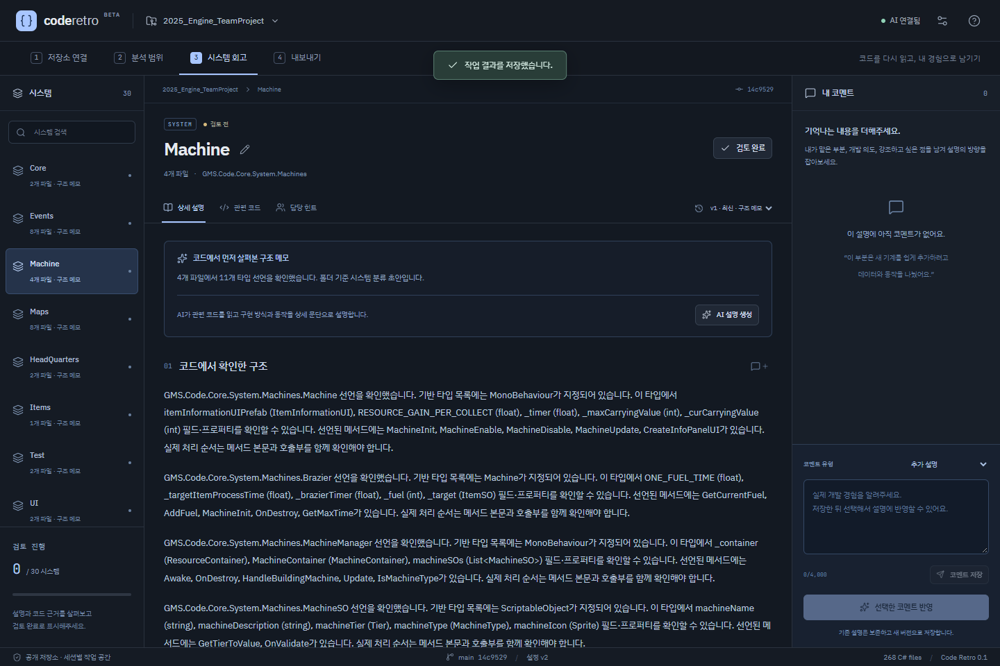

# 과거 Unity 코드를 다시 살펴보기 위한 AI 도구, Code Retro 개발기

> 2026-09-17 티스토리 공개 게시 완료: [게시글 보기](https://gwamegi08.tistory.com/38). 아래는 게시한 본문의 로컬 보관본이다.

예전에 작성한 게임 프로젝트를 포트폴리오로 정리하려고 하면, 코드를 다시 읽는 것부터 막힐 때가 있다. 어떤 기능을 만들었는지는 어렴풋이 기억나지만, 여러 클래스가 어떻게 연결되어 있었는지, 당시 어떤 방식으로 구현했는지를 글로 설명하기는 쉽지 않았다.

이 문제를 해결하기 위해 GitHub 저장소의 코드를 읽고 시스템별로 설명해주는 웹 도구 **Code Retro**를 만들었다. AI가 먼저 코드를 설명하고, 내가 코멘트를 남겨 설명의 방향을 수정하는 방식이다. 다른 사람도 설치 없이 사용할 수 있도록 웹으로 배포했다.

다만 실제로 사용해보니, 처음 기대했던 포트폴리오 정리 수준까지는 아직 부족했다. 현재는 과거에 어떤 부분을 어떤 방식으로 만들었는지 대략 짐작하고 다시 살펴보는 보조 도구에 가깝다. 이 글에서는 만들려고 했던 기능과 구현 과정, 실제로 확인한 결과와 한계를 함께 정리한다.

- **서비스:** [Code Retro 사용하기](https://code-retro-rxox.onrender.com/)
- **소스 코드:** [gominsu08/code-retro](https://github.com/gominsu08/code-retro)
- **분석에 사용한 Unity 프로젝트:** [2025_Engine_TeamProject](https://github.com/gominsu08/2025_Engine_TeamProject)

## 1. 무엇을 만들고 싶었나

목표는 과거 코드를 다시 이해하고 포트폴리오에 들어갈 내용을 정리하는 데 도움을 받는 것이었다. 이를 위해 저장소 전체를 한 번에 짧게 요약하는 것보다, 기능이나 시스템을 나눠서 구체적인 구현 방식을 설명하는 흐름을 생각했다.

예를 들어 기계 시스템이라면 단순히 “기계를 관리하는 코드”라고 끝나는 설명은 부족하다. 어떤 클래스가 공통 동작을 담당하고, 어떤 데이터가 ScriptableObject에 들어 있으며, 초기화와 자원 생산이 어떻게 연결되는지까지 설명해주기를 원했다.

팀 프로젝트에서는 담당 범위도 중요했다. 사용자가 GitHub 아이디를 직접 입력하고 개인·팀 프로젝트를 선택하도록 했으며, 분석 범위와 담당 파일을 직접 수정할 수 있게 했다. 네임스페이스와 폴더, 코드 스타일, 확인 가능한 Git 이력은 참고 정보로 사용한다. 이 정보만으로 작성자나 참여 인원을 확정하지는 않는다.

## 2. 사용 흐름과 화면 구성

현재 사용 흐름은 다음과 같다.

1. 공개 GitHub 저장소 주소와 본인의 GitHub 아이디를 입력한다.
2. 분석할 C# 파일과 외부·자동 생성 코드 제외 후보를 확인한다.
3. 시스템 목록에서 살펴볼 항목을 선택하고 AI 설명을 생성한다.
4. 설명과 코드 근거를 읽고, 기억나는 개발 내용이나 수정 요청을 코멘트로 남긴다.
5. 선택한 코멘트를 반영해 새 설명 버전을 만든다.
6. 결과를 검토하고 Markdown으로 내려받는다.

화면은 코드 편집기와 비슷한 어두운 분위기로 구성했다. 왼쪽에는 시스템 목록, 가운데에는 설명과 관련 코드, 오른쪽에는 코멘트를 배치했다. 설명을 읽다가 근거 코드를 확인하고 바로 코멘트를 남길 수 있도록 한 것이다.



*위 이미지는 AI 설명 생성 전의 구조 분석 화면이다. 코드에서 추출한 구조 메모와 실제 AI 설명은 버전 목록에서 구분한다.*

현재 시스템 구분은 폴더를 중심으로 만든 초안이다. AI가 프로젝트 전체의 의미를 파악해 시스템 경계를 자동으로 완성하는 기능까지 구현한 것은 아니다. 시스템 이름과 파일 소속은 사용자가 수정할 수 있다.

## 3. AI가 필요한 코드를 도구로 읽도록 구성하기

AI에는 코드 조회, 심볼 검색, 이력 확인, 코멘트 조회 등의 도구를 등록했다. 모델이 필요한 도구를 선택해 정보를 읽고, 확인한 근거를 포함한 설명을 제출하도록 구성했다.

| 도구 | 역할 |
| --- | --- |
| `list_source_files` | 현재 분석 범위에 포함된 파일 조회 |
| `read_code` | 지정한 파일의 코드와 줄 번호 확인 |
| `search_symbols` | 클래스·필드·메서드 등 선언 검색 |
| `get_symbol_relations` | 같은 심볼 이름이 나타나는 관계 후보 확인 |
| `get_file_history` | 고정된 커밋을 기준으로 파일의 최근 이력 조회 |
| `get_attribution_evidence` | 사용자가 지정한 담당 범위와 관련 힌트 확인 |
| `get_review_context` | 이전 설명과 이번에 반영할 코멘트 확인 |

서버의 도구 등록 코드는 다음과 같다.

```python
def registered_tools():
    return [
        {
            "type": "function",
            "name": name,
            "description": description,
            "parameters": schema.model_json_schema(),
            "strict": True,
        }
        for name, (schema, description) in REGISTRY.items()
    ]
```

`REGISTRY`에 등록한 도구 이름과 설명, 입력 형식을 모델에 전달하는 부분이다. 모델이 호출을 요청하면 서버가 입력과 분석 범위를 검사한 뒤 해당 읽기 도구를 실행한다. 저장소에 들어 있는 코드를 실제로 실행하거나 빌드하지는 않는다.

분석할 코드는 특정 커밋으로 고정한다. 코드 근거에는 파일과 줄 범위를 연결하고, 설명에서 인용한 근거가 실제 도구로 확인한 것인지 검사한다. 설명의 주장도 코드에서 확인한 내용, Git 이력, 사용자 설명, 추정으로 구분한다.

이 검사는 인용 위치와 형식을 확인하는 장치다. 문장의 의미까지 모두 정확하다고 보장하는 기능은 아니며, 실제 검증에서도 그 한계가 나타났다.

## 4. 기술 구성과 배포

| 구분 | 사용한 기술 |
| --- | --- |
| 웹 화면 | React, TypeScript, Vite |
| API 서버 | Python, FastAPI |
| C# 구조 분석 | Tree-sitter |
| 데이터 저장 | SQLAlchemy, 로컬 SQLite, 배포 환경 PostgreSQL |
| DB 변경 관리 | Alembic |
| AI | Gemini API |
| 배포 | Docker, Render Free, Neon Free |
| 자동 검증 | GitHub Actions |

브라우저가 분석을 요청하면 API 서버가 작업을 등록하고, 별도 worker 프로세스가 코드 수집과 AI 설명 생성을 처리한다. 화면에서는 작업의 진행 상태와 결과를 조회한다. 프로젝트, 코멘트, 설명 버전은 DB에 저장한다.

로컬에서는 SQLite를 사용하고, 공개 서버에서는 Neon PostgreSQL을 사용했다. Render 컨테이너가 다시 배포되어도 결과를 유지하도록 웹 서버의 임시 디스크와 데이터 저장소를 분리했다. API와 worker는 하나의 Docker 컨테이너 안에서 별도 프로세스로 실행한다.

운영 비용은 무료를 우선했다. Gemini 키와 DB 연결 정보는 서버 환경 변수로 설정하고 소스 저장소에서는 제외했다. 전체 프로젝트 수, 요청 횟수, 저장 공간, AI 토큰 사용량에도 상한을 두었다.

서비스 이용에는 별도 설치가 필요 없다. 직접 개발 환경을 구성하려면 Python 3.12와 Node.js 24를 기준으로 [README의 설치·실행 안내](https://github.com/gominsu08/code-retro#readme)를 따라가면 된다. 무료 서버는 한동안 방문이 없으면 쉬었다가 다시 시작하므로 첫 접속이 늦을 수 있다.

## 5. 구현하면서 확인한 문제

### API 연결만으로는 도구 호출이 완성되지 않았다

Gemini에 전달할 도구 스키마를 변환하는 과정에서, 메타데이터를 정리하는 코드가 실제 데이터의 `title` 속성까지 제거하는 문제가 있었다. 속성 이름을 보존하도록 수정하고 중첩된 스키마도 검사했다. API가 응답하는 것과 필요한 형식의 도구 호출이 정상 동작하는 것을 따로 확인해야 했다.

### 첫 설명에 불필요하게 긴 문맥이 들어갔다

구조 분석으로 만든 긴 메모를 처음 AI 설명을 생성할 때도 이전 설명처럼 전달하는 경우가 있었다. 이 때문에 입력 문맥이 커지고 한도에 영향을 주었다. 첫 생성은 코드 본문을 읽는 흐름으로 구분하고, 기존 AI 설명을 수정할 때만 이전 설명과 근거를 가져오도록 정리했다.

### 공개 주소와 서버 설정이 일치해야 했다

배포 후에는 실제 발급된 HTTPS 주소를 `PUBLIC_BASE_URL`에도 정확하게 반영해야 했다. 브라우저 요청 출처와 세션 보호를 검사하기 때문에, 예상한 서비스 이름과 실제 주소가 다르면 정상 요청에도 영향을 줄 수 있었다. 실제 주소로 설정을 저장하고 다시 배포한 뒤 세션 동작을 확인했다.

### 코드 근거가 있어도 AI 설명은 틀릴 수 있었다

가장 중요한 검증 사례는 `MachineSO` 설명이었다. 강조 코멘트를 반영한 설명에 채집 시간이 `MachineSO`의 설정 데이터에 들어 있다는 내용이 포함되었다. 하지만 실제 `MachineSO.cs` 전체를 확인하니 채집 시간 필드는 없었다.

확인한 코드에서 기본 `Machine`의 채집 주기는 `RESOURCE_GAIN_PER_COLLECT = 5f` 상수를 사용한다. 생산량은 `machineSO.GetTierToValue(_targetItemData.tier) / 12`로 계산하며, `MachineInit`에서는 `machineSO.maxCarryingValue`를 읽어 최대 적재량을 설정한다.

이 차이를 내용 수정 코멘트로 전달해 다시 확인하도록 했고, 다음 버전에서는 본문의 설명이 수정되었다. 이전 설명도 버전 목록에 남았다. 다만 별도의 추정 항목은 계속 확인 대상으로 표시되었다. 이 사례를 통해 AI 출력에 근거 링크를 붙이는 것과 설명 자체가 정확한 것은 별개의 문제라는 점을 확인했다.

## 6. 실제로 확인한 결과

샘플 프로젝트에서 기본 분석 대상 C# 파일 112개를 수집했고, 폴더 기준 시스템 30개가 생성되었다. 공개 웹 환경에서 실제 Gemini 설명 생성, 코멘트 반영, 버전 보존, 코드 원문 조회, 검토 표시와 Markdown 다운로드를 확인했다.

Machine 설명은 v2 생성 후 코멘트를 반영한 v3, 내용 수정을 반영한 v4까지 저장되었다. 최종 v4 본문은 585자·2개 문단이었으며, 근거와 메타데이터를 포함한 Markdown 파일은 3,824자였다. 새로고침 후에도 설명·코멘트·검토 상태가 유지되었다. 앞선 컨테이너 재배포에서도 저장 자료가 유지되는 것을 확인했다.

자동 검증에서는 SQLite 환경 26개, PostgreSQL 환경 27개 테스트가 통과했다. Linux Docker 컨테이너에서 API와 worker, 웹 화면이 실행되는 것도 확인했다. 관련 기록은 [GitHub Actions](https://github.com/gominsu08/code-retro/actions/runs/35171364895)에 남겨두었다.

배포한 주소를 다른 기기에서도 직접 열어 AI 설명이 생성되는 것을 확인했다. 링크만 전달해 웹 브라우저에서 실제 기능을 사용할 수 있다는 배포 목표는 달성했다.

## 7. 직접 사용해본 후기

처음 계획했던 것은 코드 내용을 확인해서 포트폴리오를 정리하는 데 사용하는 것이었다. 하지만 실제로 사용해보니, 현재 결과만으로 그 정도까지 활용하기는 어렵다고 느꼈다.

어떤 부분을 어떤 방식으로 만들었는지 대략 짐작하는 정도는 가능했다. 예전 코드를 다시 살펴볼 때 참고할 출발점은 될 수 있지만, 포트폴리오에 쓸 만큼 구체적이고 정확한 설명으로 정리하려면 내가 코드를 다시 확인하고 내용을 보완해야 했다.

현재의 핵심 한계는 설명을 생성하는 기능과, 실제로 활용할 수 있는 회고 글을 만드는 기능 사이에 차이가 있다는 점이다. 특히 팀 프로젝트의 실제 담당 범위와 당시의 설계 의도는 현재 코드만으로 알아내기 어렵다. 그럴듯한 설명이 나와도 내 경험이나 실제 구현과 일치하는지 확인해야 한다.

앞으로는 설명의 양을 늘리는 것보다 관련 코드의 연결 관계를 더 정확하게 확인하고, 부족한 정보를 사용자에게 구체적으로 질문하는 흐름을 개선하고 싶다. 실제 담당과 개발 의도를 충분히 확인한 다음, 검토한 내용을 포트폴리오용 글로 정리하는 단계를 보완할 필요가 있다.

## 8. 남은 개선점

- **시스템 구분:** 현재 폴더 중심 분류에 클래스와 데이터 간 관계를 더 반영하기.
- **설명의 정확성:** 코멘트의 요청이나 가정을 구현 사실로 받아들이지 않도록 충돌 확인과 근거 검토 보완하기.
- **회고 질문:** “왜 이렇게 만들었는지”, “어느 부분을 직접 담당했는지”를 더 구체적으로 질문하기.
- **포트폴리오 정리:** 검토한 구현 내용과 실제 경험을 연결해 글로 다듬는 단계 보완하기.
- **저장과 접근:** 현재 브라우저 세션별 작업 공간에서 계정 로그인·기기 간 동기화·장기 보관으로 확장 검토하기.

현재 버전의 가장 분명한 결과는 공개 저장소의 코드를 읽고, 설명과 근거를 확인하며, 코멘트로 내용을 수정하는 웹 흐름을 실제로 배포했다는 것이다. 다음 개선의 기준은 기능 수보다 과거 코드를 제대로 이해하고 정리하는 데 얼마나 도움이 되는지가 되어야 한다.

---

**관련 링크**

- [Code Retro 서비스](https://code-retro-rxox.onrender.com/)
- [GitHub 소스 코드와 README](https://github.com/gominsu08/code-retro)
- [개발 기록](https://github.com/gominsu08/code-retro/blob/main/docs/DEVELOPMENT_LOG.md)
- [배포 구성과 운영 기록](https://github.com/gominsu08/code-retro/blob/main/docs/DEPLOYMENT.md)

**추천 태그:** Unity, CSharp, Python, FastAPI, React, Gemini, AI에이전트, 개발회고, 개인프로젝트
